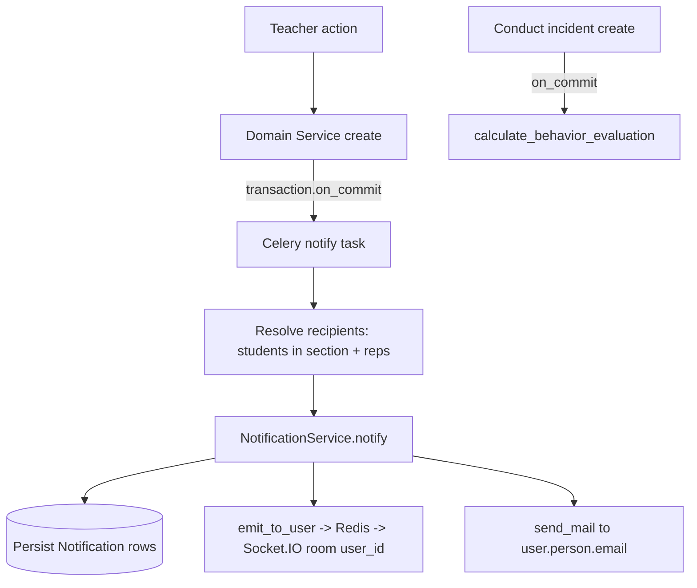

# Realtime Notifications Refactor

## Decisions (confirmed)

- Notifications are **persisted** (new `Notification` model + REST endpoints) AND emitted live + email.
- Shared service lives in **`apps/core/realtime/`** (no new `apps/shared`).
- Grading notifies **only the graded student + their reps** (not the whole section).
- New events also send **email** (reuse the absence email pattern).

## Part 1 - Abstract & move Socket.IO into `apps/core`

Currently the server lives in [apps/analytics/socketio.py](apps/analytics/socketio.py) and the worker-side Redis emit is duplicated in [apps/analytics/tasks.py](apps/analytics/tasks.py) (`_emit_task_completed`) and [apps/attendance/attendance_core/tasks.py](apps/attendance/attendance_core/tasks.py) (`_emit_socketio_event`).

- Create `apps/core/realtime/server.py`: move the `sio = socketio.AsyncServer(...)` + `connect`/`disconnect` handlers verbatim from `apps/analytics/socketio.py`.
- Create `apps/core/realtime/emitter.py` with a single reusable worker-side function `emit_to_user(user_id, event, data)` (the python-socketio Redis-protocol publish, deduplicated from the two existing copies).
- Update [config/asgi.py](config/asgi.py): `from apps.core.realtime.server import sio`.
- Replace the duplicated emit helpers in `apps/analytics/tasks.py` and `apps/attendance/attendance_core/tasks.py` with imports of `emit_to_user`.
- Remove `apps/analytics/socketio.py` (only `config/asgi.py` referenced it).

## Part 2 - Persisted `Notification` model + REST API

- Add `apps/core/models/notification.py` -> `Notification(TimeStampedModel)`: `recipient` (FK `iam.User`), `notification_type` (CharField w/ choices: ACTIVITY_CREATED, ACTIVITY_GRADED, ATTENDANCE_CREATED, INCIDENT_CREATED), `title`, `body`, `data` (JSONField, default dict), `is_read` (bool, default False), `read_at` (nullable). Register in `apps/core/models/__init__.py`.
- New migration `apps/core/migrations/0002_notification.py` (via `makemigrations core`).
- `apps/core/repositories/notification_repo.py`: `bulk_create_for_users(...)`, `list_for_user(user)`, `unread_count(user)`, `mark_read(id, user)`, `mark_all_read(user)`.
- `apps/core/api/views.py` -> `NotificationViewSet` (currently empty file): `list` (own notifications, paginated, `RoleBasedFilterBackend` bypassed by `get_queryset` filtering `recipient=request.user`), `unread-count`, `mark-read` (`POST /{id}/mark-read/`), `mark-all-read`. Permission: `IsAuthenticated` (own rows only; no new permission constant needed).
- Serializer in `apps/core/api/serializers.py`.
- Add `router.register(...)` in [apps/core/urls.py](apps/core/urls.py) (currently empty) and mount `path("api/notifications/", include("apps.core.urls"))` in [config/urls.py](config/urls.py).

## Part 3 - Notification dispatch service + recipient resolution

- `apps/core/notifications/service.py` -> `NotificationService.notify(user_ids, notification_type, title, body, data, send_email=True)`: persists `Notification` rows (bulk), emits Socket.IO via `emit_to_user` per recipient, and sends email via `django.core.mail.send_mail` to `user.person.email` when present (mirrors `notify_representatives_of_absence`).
- Recipient resolution helpers (reuse existing repos):
  - Students in a section: `EnrollmentRepository.get_students_by_section(section, "ACT")` -> `enrollment.student.user_id`.
  - Reps of a student: `StudentRepresentativeRepository.get_by_student(student_id).filter(is_active=True, receives_notifications=True)` -> `rep.user_id`.
- `apps/core/notifications/tasks.py` -> Celery tasks: `notify_activity_created(activity_id)`, `notify_activity_graded(note_id)`, `notify_attendance_created(attendance_id)`, `notify_incident_created(incident_id)`. Each resolves recipients then calls `NotificationService.notify(...)`.

## Part 4 - Wire the four event triggers (service-layer + transaction.on_commit)

Mirror the existing attendance pattern (`transaction.on_commit(lambda: task.delay(...))`):

- **Activity created** -> in `EvaluationService.create_evaluative_activity` ([apps/grading/evaluation/domain/services.py](apps/grading/evaluation/domain/services.py)). Recipients = all active students in `activity.teacher_subject_section.subject_offering.section_id` + their reps. Enqueue `notify_activity_created.delay(activity.id)`.
- **Activity graded** -> in `StudentNoteService.create_student_note` / `update_student_note` ([apps/grading/student_note/domain/services.py](apps/grading/student_note/domain/services.py)). Recipients = `note.enrollment.student` + their reps only. Enqueue `notify_activity_graded.delay(note.id)`.
- **Attendance created** -> in `AttendanceService.create_attendance` ([apps/attendance/attendance_core/domain/services.py](apps/attendance/attendance_core/domain/services.py)), alongside existing `_maybe_notify_absence`. Recipients = the attendance's student + reps. Enqueue `notify_attendance_created.delay(attendance.id)`. (Keep the existing absence-specific email flow.)
- **Incident created** -> in `ConductIncidentService.create_conduct_incident` ([apps/behavior/conduct_incident/domain/services.py](apps/behavior/conduct_incident/domain/services.py)). Recipients = `incident.enrollment.student` + reps. Enqueue `notify_incident_created.delay(incident.id)`.

## Part 5 - Recalculate conduct average on incident creation

- In `ConductIncidentService.create_conduct_incident`, also `transaction.on_commit` enqueue a task that calls `BehaviorEvaluationService.calculate_behavior_evaluation(enrollment_id, academic_period_id)` ([apps/behavior/behavior_evaluation/domain/services.py](apps/behavior/behavior_evaluation/domain/services.py)). `academic_period_id` comes from `incident.academic_period_id`. Add this task in `apps/behavior/conduct_incident/tasks.py` (which today only holds a sync handler).

## Part 6 - Weighted academic average on grading (the real "promedio" requirement)

Grading already enqueues a recompute via the `StudentNote` `post_save` signal -> `recompute_period_grade_summary_task` ([apps/grading/student_note/signals.py](apps/grading/student_note/signals.py)) -> `GradeCalculationService.calculate_period_summary`. The problem is the underlying calculation is **naive**: it does a flat `Avg("numeric_score")` that ignores all weights, does not normalize by `max_score`, and does not filter by period.

```138:149:apps/grading/student_note/infrastructure/repositories.py
    @staticmethod
    def calculate_period_average_for_subject(enrollment_id, subject_offering_id):
        from django.db.models import Avg

        result = StudentNote.objects.filter(
            enrollment_id=enrollment_id,
            evaluative_activity__teacher_subject_section__subject_offering_id=subject_offering_id,
        ).aggregate(avg=Avg("numeric_score"))
```

### Weight hierarchy (all already enforced to sum 100% by existing validators)

- `EvaluativeActivity.internal_weight` (% within its `BlockComponent`)
- `BlockComponent.internal_weight` (% within its `EvaluationBlock`)
- `EvaluationBlock.weight_percentage` (% within the period, per `subject_offering` + `academic_period`)
- Per-note normalization to base 10: numeric via `StudentNote.calculate_normalized_value()` (`numeric_score / max_score * 10`); qualitative via `qualitative_scale.numeric_equivalence`.

### New calculation (decisions confirmed)

Rewrite `EvaluationRepository.calculate_period_average_for_subject(enrollment_id, subject_offering_id, academic_period_id)` (add the `academic_period_id` arg and pass it from `recompute_period_grade_summary_task` / `calculate_period_summary`) to compute hierarchically:

```text
component_grade = sum(act.internal_weight * normalized_note) / sum(act.internal_weight)   # only graded activities
block_grade     = sum(comp.internal_weight * component_grade) / sum(comp.internal_weight) # only components with grades
period_grade    = sum(block.weight_percentage * block_grade) / sum(block.weight_percentage) # only blocks with grades
```

- **Partial grading -> renormalize**: at every level divide by the sum of the weights actually present (graded), so the average is a live running value that adjusts as more activities are graded (confirmed choice).
- **Scope = per period only** (confirmed): no annual aggregation via `year_weight` for now.
- **Single weighted final** (confirmed): store the hierarchical result in `final_avg_truncated`; additionally compute and store `formative_avg` (blocks of type FORMATIVA) and `summative_avg` (SUMATIVA/PROJECT) as the informational per-`block_type` breakdown in `GradeCalculationService.calculate_period_summary` ([apps/grading/student_note/domain/services.py](apps/grading/student_note/domain/services.py)).
- Filter strictly by the activity's block period: `...block_component__evaluation_block__academic_period_id == academic_period_id`, and skip notes that are `manually_overridden` / have null score.

This keeps the existing trigger/signal wiring; only the math inside the repository + summary service changes. No schema change is needed (the fields already exist).

## Part 7 - Tests

- Add tests under `apps/core/tests/` for the `Notification` API and `NotificationService` fan-out (mock `emit_to_user` and `send_mail`).
- Add/extend tests for each trigger asserting the correct task is enqueued and conduct recalc runs on incident creation.
- Add tests for the weighted average: verify activity/component/block weighting, `max_score` normalization, qualitative `numeric_equivalence`, period filtering, and renormalization when only some activities are graded (running average).
- Run with `python manage.py test --settings=config.settings.test` (eager Celery makes `.delay` run inline).

## Data flow


